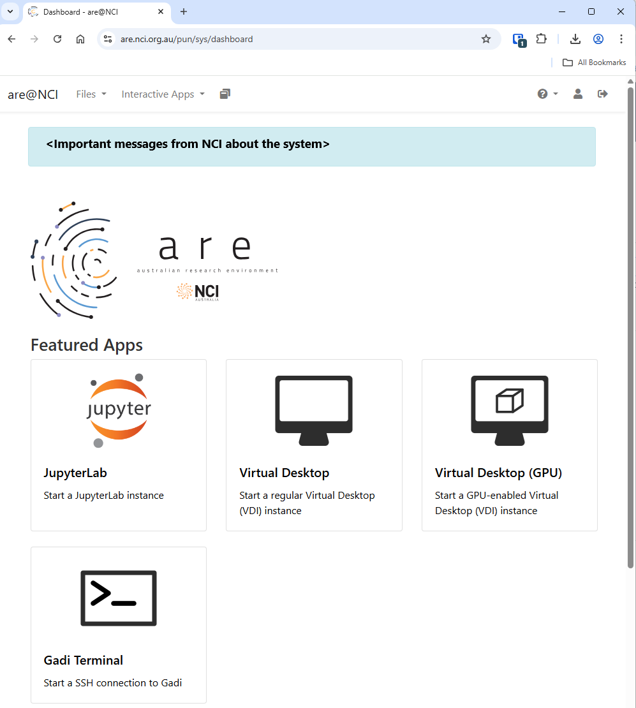
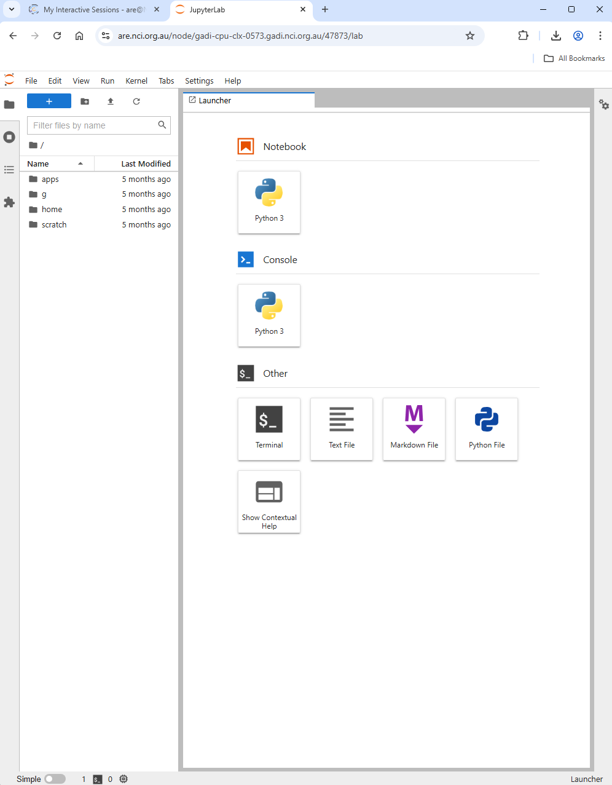

## NCI Account Setup
Sign up for an  [NCI account](https://my.nci.org.au/)  if you don’t already have one.

Select  **Projects and groups**  from the left hand side menu and then select the  **Find project or group**  tab. Search for  **cd82**, the NCI-QCIF Training Partnership Project, and ask to join.

## NCI Australian Research Environment (ARE)

----------

Connect to  [NCI Australian Research Environment](https://are.nci.org.au/).

Be sure you use your NCI ID (eg, ab1234) for the username and not your email address.

Under  **Featured Apps**, find and click the  **JupterLab: Start a JupyterLab instance**  option.

To Launch a JuptyerLab session, set these resource requirements:

| Resource                                 | Value                     |
| ---------------------------------------- | ------------------------- |
| Walltime (hours)                         | 5                         |
| Queue                                    | normal                    |
| Compute Size                             | small                     |
| Project                                  | cd82                      |
| Storage                                  | scratch/cd82              |
| Advanced Options…                        |                           |
| Modules                                  | python3/3.9.2             |
| Python or Conda virtual environment base | /scratch/cd82/venv_icwcnn |

Then click the Launch button.

This will take you to your interactive session page you will see that that your JupyterLab session is Queued while ARE is searching for a compute node that will satisfy your requirements.

Once found, the page will update with a button that you can click to Open JupyterLab.

Here is a screenshot of a JupyterLab landing page that should be similar to the one that opens in your web browser after starting the JupyterLab server on either macOS or Windows.

